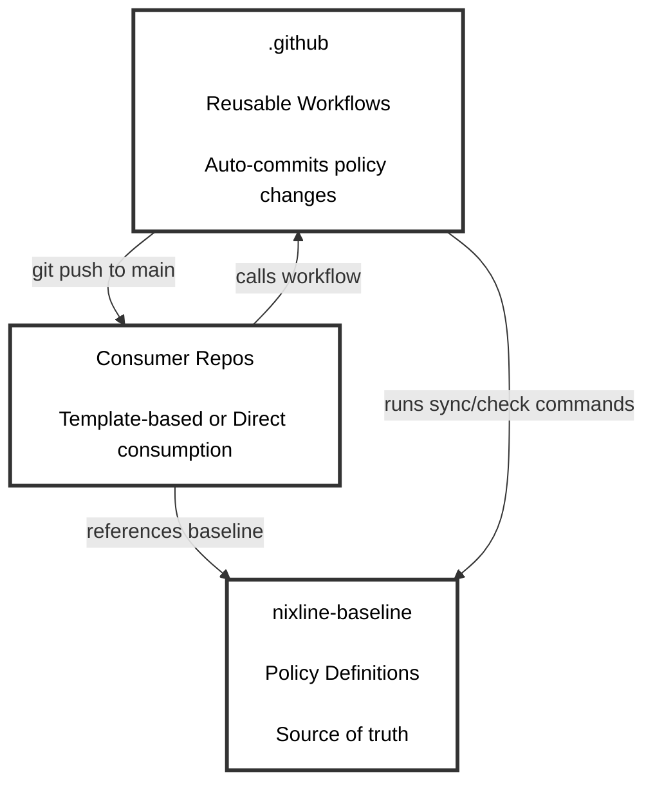

# NixLine Reusable Workflows

This repository contains reusable GitHub Actions workflows for the NixLine organization.

---

## Overview

This is the special `.github` repository that provides **reusable workflows** for all repositories in the NixLine organization. These workflows enforce consistent CI/CD practices, policy compliance and automation across the entire organization.

### What is This Repository?

GitHub allows organizations to create a special repository named `.github` that can:
- Provide **default community health files** (CODE_OF_CONDUCT, CONTRIBUTING, etc.)
- Host **reusable workflows** that any repo in the org can call
- Define **organization-wide templates** and standards

**NixLine uses this repository for:** Reusable CI/CD workflows that integrate with the NixLine baseline.

---

## Architecture

NixLine uses a three-repository architecture with instant policy materialization. Consumer repositories can use either template-based or direct consumption patterns:



The **`.github`** repository (this repo) contains reusable workflows that auto-commit policy updates. The **`nixline-baseline`** repository stores policy packs and Nix apps. **Consumer repos** are your actual projects with automated sync enabled.

**Three consumption patterns:**
- **Direct (Default):** `nix run github:org/baseline#sync` - no configuration files needed
- **Configuration-driven (Recommended):** `nix run github:org/baseline#sync -- --config .nixline.toml` - organization branding via TOML
- **Template-based:** Consumer repos have `flake.nix` with baseline as input for external packs

**Instant materialization:** Policy changes are pushed directly to consumer repos without PR bottlenecks. Organizations requiring review can use branch protection rules.

**Note on forking:** Organizations should fork this repository to customize workflows for their own baseline. The workflows reference specific baseline repositories and need to be updated to point to your organization's forked baseline. This gives you complete control over CI/CD automation while maintaining the same workflow structure.

---

## Available Workflows

This repository provides several reusable workflows for NixLine automation. Each workflow serves a specific purpose in the governance and automation pipeline.

### Overview

| Workflow | Purpose | Used By | Pattern |
|----------|---------|---------|---------|
| `nixline-ci.yml` | Basic CI validation | All consumer repos | All patterns |
| `nixline-policy-sync.yml` | Direct policy sync | Consumer repos | Direct commit |
| `nixline-policy-sync-pr.yml` | Policy sync with PRs | Consumer repos | Auto-approved PRs |
| `nixline-auto-approve.yml` | Auto-approve PRs | Consumer repos | Auto-approved PRs |
| `nixline-dependabot-automerge.yml` | Dependabot auto-merge | Consumer repos | Dependency automation |
| `nixline-flake-update.yml` | Flake lock updates | Template-based repos | Template pattern |
| `nixline-policy-flake-lock-only.yml` | Policy lock updates | Template-based repos | Template pattern |

### Basic CI (`nixline-ci.yml`)

Provides fundamental CI validation for NixLine consumer repositories including policy compliance checks and basic testing.

**Features:**
- Policy compliance validation
- Nix flake evaluation
- Basic health checks
- Supports all consumption patterns

**Usage:**
```yaml
jobs:
  nixline-ci:
    uses: YOUR-ORG/.github/.github/workflows/nixline-ci.yml@stable
    with:
      channel: stable
      consumption_pattern: direct  # or configuration-driven, template-based
```

### Policy Sync (`nixline-policy-sync.yml`)

Automatically syncs policy files from the baseline repository with instant materialization.

**Included in:** Consumer template (`nixline-baseline/templates/consumer/.github/workflows/policy-sync.yml`)

**Usage:**

**Template-based repositories:**
```yaml
# .github/workflows/policy-sync.yml
name: Policy Sync
on:
  schedule:
    - cron: '0 14 * * 0'  # Weekly on Sunday at 2 PM UTC
  workflow_dispatch:
jobs:
  sync:
    uses: YOUR-ORG/.github/.github/workflows/nixline-policy-sync.yml@stable
    with:
      consumption_pattern: template-based
      baseline_ref: stable
```

**Direct consumption and configuration-driven repositories:**
```yaml
# .github/workflows/policy-sync.yml (or add to existing ci.yml)
name: Policy Sync
on:
  schedule:
    - cron: '0 14 * * 0'  # Weekly on Sunday at 2 PM UTC
  workflow_dispatch:
jobs:
  sync:
    uses: YOUR-ORG/.github/.github/workflows/nixline-policy-sync.yml@stable
    with:
      consumption_pattern: direct
      baseline_repo: YOUR-ORG/nixline-baseline
      baseline_ref: stable
      # Optional: specify configuration file for organization branding
      config_file: .nixline.toml
```

**What it does:**

The workflow runs sync/check commands to validate policies. If out of sync, it materializes updated policy files, then auto-commits and pushes changes directly to the main branch.

**Command patterns used:**
- **Template-based repos:** `nix run .#check` and `nix run .#sync`
- **Direct consumption repos:** `nix run github:ORG/nixline-baseline#check` and `nix run github:ORG/nixline-baseline#sync`
- **Configuration-driven repos:** `nix run github:ORG/nixline-baseline#sync -- --config .nixline.toml`

**Key advantage:** Traditional governance systems create pull requests for every baseline update, requiring manual review across potentially hundreds of repositories. This workflow eliminates that bottleneck by materializing changes instantly through Nix flakes and committing them automatically. Policy updates propagate immediately without manual intervention.

**Enhanced baseline features:**
- **Runtime configuration passing**: Organizations can customize policies via `.nixline.toml` without forking
- **CLI overrides**: `--override org.name=MyCompany` for runtime customization
- **Custom file support**: Complete file override capability with `custom_file` parameters
- **Parameterized packs**: All policy packs accept configuration for organization branding
- **SPDX license fetching**: Automatic license retrieval with proper attribution

**Branch protection:** Organizations requiring review before policy changes can configure branch protection rules to enforce PR workflows.

**Customization:**
```yaml
# Change the schedule in your consumer repo
schedule:
  - cron: '0 14 * * 0'  # Sunday 2 PM UTC (default)
  #- cron: '0 9 * * 1'   # Monday 9 AM UTC
```

### Policy Sync with Auto-Approved PRs (`nixline-policy-sync-pr.yml`)

Creates pull requests for policy updates with optional auto-approval for enterprise governance requirements.

**Enterprise-Ready Features:**
- Creates PRs instead of direct commits for audit trails
- Auto-approval integration for policy-only changes
- Works with GitHub's auto-merge functionality
- Detailed PR descriptions with change summaries
- Support for branch protection rules

**Usage for Auto-Approved PR Pattern:**
```yaml
# .github/workflows/policy-sync.yml
name: Policy Sync
on:
  schedule:
    - cron: '0 14 * * 0'  # Weekly on Sunday at 2 PM UTC
  workflow_dispatch:

jobs:
  sync:
    uses: YOUR-ORG/.github/.github/workflows/nixline-policy-sync-pr.yml@stable
    with:
      consumption_pattern: direct
      baseline_repo: YOUR-ORG/nixline-baseline
      baseline_ref: stable
      create_pr: true
      auto_approve: true
```

**Required Auto-Approval Workflow:**
```yaml
# .github/workflows/auto-approve.yml
name: Auto Approve Policy Updates
on:
  pull_request:
    types: [opened, synchronize]

jobs:
  auto-approve:
    uses: YOUR-ORG/.github/.github/workflows/nixline-auto-approve.yml@stable
    with:
      pr_title_pattern: "Policy Sync"
      actor_filter: "github-actions[bot]"
      merge_method: "squash"
      enable_auto_merge: true
      require_checks: true
```

**Enterprise Setup Requirements:**
1. Enable branch protection requiring PR reviews in repository settings
2. Configure auto-merge in repository settings
3. Add the auto-approval workflow to consumer repositories
4. Ensure CI checks validate policy changes before merge

**Demonstrated in:** [nixline-demo3](https://github.com/NixLine-org/nixline-demo3) showcases this pattern with pure upstream consumption and zero maintenance overhead.

### Auto-Approve (`nixline-auto-approve.yml`)

Reusable workflow for automatically approving and merging PRs that meet specified criteria.

**Features:**
- Configurable PR title patterns for approval
- Actor filtering for security
- Multiple merge methods (merge, squash, rebase)
- Optional auto-merge enablement
- Detailed approval comments with audit trail

**Usage:**
```yaml
# .github/workflows/auto-approve.yml
name: Auto Approve
on:
  pull_request:
    types: [opened, synchronize]

jobs:
  auto-approve:
    uses: YOUR-ORG/.github/.github/workflows/nixline-auto-approve.yml@stable
    with:
      pr_title_pattern: "Policy Sync"  # Pattern to match in PR title
      actor_filter: "github-actions[bot]"  # Must be created by this actor
      merge_method: "squash"  # merge, squash, or rebase
      enable_auto_merge: true  # Enable GitHub auto-merge
      require_checks: true  # Require status checks to pass
```

**Common Use Cases:**
- Policy sync PRs from automated workflows
- Dependabot PRs for patch/minor updates
- Documentation updates from bots
- License file updates from SPDX fetching

**Security Considerations:**
- Always use actor filtering to prevent unauthorized approvals
- Configure branch protection rules as additional safeguards
- Require status checks to pass before auto-merge
- Use specific PR title patterns to limit scope

### Dependabot Auto-Merge (`nixline-dependabot-automerge.yml`)

Automatically approves and merges Dependabot PRs for patch and minor updates when CI passes.

**Features:**
- Auto-approves patch and minor version updates
- Requires CI checks to pass before merge
- Maintains audit trail through PR comments
- Configurable version update policies

**Usage:**
```yaml
# .github/workflows/dependabot-automerge.yml
name: Dependabot Auto-Merge
on:
  pull_request:
    types: [opened, synchronize]

jobs:
  automerge:
    if: github.actor == 'dependabot[bot]'
    uses: YOUR-ORG/.github/.github/workflows/nixline-dependabot-automerge.yml@stable
```

**Merge Policy:**
- Patch updates (1.0.0 → 1.0.1): Auto-merge
- Minor updates (1.0.0 → 1.1.0): Auto-merge
- Major updates (1.0.0 → 2.0.0): Require manual review

### Flake Updates (`nixline-flake-update.yml`)

Updates flake.lock files for template-based repositories to keep dependencies current.

**Features:**
- Automated flake.lock updates
- Creates PRs with dependency changes
- Includes detailed change summaries
- Template-based consumption pattern only

**Usage:**
```yaml
# .github/workflows/flake-update.yml
name: Flake Update
on:
  schedule:
    - cron: '0 0 * * 1'  # Weekly on Monday
  workflow_dispatch:

jobs:
  update:
    uses: YOUR-ORG/.github/.github/workflows/nixline-flake-update.yml@stable
```

### Policy Lock Updates (`nixline-policy-flake-lock-only.yml`)

Updates only the baseline policy flake lock for template-based repositories.

**Features:**
- Updates baseline flake input only
- Preserves other dependency versions
- Focused policy-only updates
- Template-based consumption pattern only

**Usage:**
```yaml
# .github/workflows/policy-lock-update.yml
name: Policy Lock Update
on:
  schedule:
    - cron: '0 12 * * 0'  # Weekly on Sunday
  workflow_dispatch:

jobs:
  update:
    uses: YOUR-ORG/.github/.github/workflows/nixline-policy-flake-lock-only.yml@stable
```

---

## Forking for Your Organization

When you fork NixLine for your organization, start by forking this repository:

```bash
gh repo fork NixLine-org/.github --org YOUR-ORG --fork-name .github
cd .github
```

Most workflows are consumer-side (in the template), but you can add organization-wide workflows here. For example, create a reusable security scan workflow:

```yaml
# .github/workflows/org-wide-security-scan.yml
name: Organization Security Scan

on:
  workflow_call:
    # Define reusable workflow that all repos can call
```

After making changes, tag and publish your workflows:

```bash
git add .
git commit -m "feat: initialize org workflows"
git push origin main

git tag -a stable -m "Initial stable release"
git push origin stable
```

Consumer repos can then reference your workflows:

```yaml
# Consumer repo .github/workflows/ci.yml
jobs:
  security-scan:
    uses: YOUR-ORG/.github/.github/workflows/org-wide-security-scan.yml@stable
```

---

## Workflow Best Practices

### Version Pinning

Always use tags when calling reusable workflows:

```yaml
# Good - pinned to stable tag
uses: YOUR-ORG/.github/.github/workflows/some-workflow.yml@stable

# Bad - uses latest main (unpredictable)
uses: YOUR-ORG/.github/.github/workflows/some-workflow.yml@main
```

### Updating Workflows

When you update workflows in this repo:

1. Test in a consumer repo first
2. Commit and push to `main`
3. Re-tag `stable`:
   ```bash
   git tag -d stable
   git push origin :refs/tags/stable
   git tag -a stable -m "Update workflows"
   git push origin stable
   ```
4. Consumer repos will use the new version on their next run

---

## Consumer Workflow Setup

Consumer repositories are initialized using the baseline's template system. When you run `nix flake init -t github:YOUR-ORG/nixline-baseline` in a new repository, Nix copies files from the baseline's `templates/consumer/` directory, which includes the policy sync workflow preconfigured.

### Policy Sync Workflow

```yaml
# .github/workflows/policy-sync.yml (included in template)
name: Policy Sync

on:
  schedule:
    - cron: '0 14 * * 0'  # Weekly on Sunday at 2 PM UTC
  workflow_dispatch:

jobs:
  sync:
    uses: YOUR-ORG/.github/.github/workflows/nixline-policy-sync.yml@stable
```

This calls the reusable workflow which handles checking, syncing and committing policy changes automatically.

### Optional: CI Policy Check

Add a policy check to your CI workflow to ensure policies stay in sync. Choose the pattern based on your consumption approach:

**Template-based approach:**
```yaml
# .github/workflows/ci.yml
name: CI
on: [push, pull_request]
jobs:
  policy-check:
    runs-on: ubuntu-latest
    steps:
      - uses: actions/checkout@v4
      - uses: cachix/install-nix-action@v31
      - name: Verify policies are in sync
        run: nix run .#check
```

**Direct consumption and configuration-driven approach:**
```yaml
# .github/workflows/ci.yml
name: CI
on: [push, pull_request]
jobs:
  policy-check:
    runs-on: ubuntu-latest
    steps:
      - uses: actions/checkout@v4
      - uses: cachix/install-nix-action@v31
      - name: Verify policies are in sync
        run: nix run github:YOUR-ORG/nixline-baseline#check
        # Note: Configuration files are automatically detected by the check command
```

---

## Relationship to Baseline

The `.github` repository and `nixline-baseline` repository serve different purposes:

| Repository | Purpose | Contains |
|------------|---------|----------|
| `.github` | GitHub Actions automation | Reusable workflows |
| `nixline-baseline` | Policy definitions | Nix packs, apps and templates |

**Consumer repos reference both:**
- **Flake input** → `nixline-baseline` (for policies)
- **Workflow `uses:`** → `.github` (for CI automation)

Example consumer `flake.nix`:
```nix
{
  inputs = {
    nixpkgs.url = "github:NixOS/nixpkgs/nixos-unstable";
    nixline-baseline = {
      url = "github:YOUR-ORG/nixline-baseline?ref=stable";
      inputs.nixpkgs.follows = "nixpkgs";
    };
  };
}
```

Example consumer workflow:
```yaml
# References .github repo for reusable workflows
uses: YOUR-ORG/.github/.github/workflows/some-workflow.yml@stable
```

---

## CODEOWNERS for This Repository

This repository should have its own CODEOWNERS file (NOT managed by NixLine packs):

```
# .github/CODEOWNERS
* @YOUR-ORG/platform-team
/.github/workflows/ @YOUR-ORG/devops
```

Why separate? The `.github` repo defines the automation infrastructure. It needs platform/DevOps ownership, not the same ownership rules as consumer repos.

---

## Maintenance

### Adding New Workflows

1. Create workflow in `.github/workflows/`
2. Test in a consumer repo using `@main`
3. Commit and re-tag `stable`
4. Update consumer repos to use the new workflow

### Deprecating Workflows

1. Add deprecation notice to workflow comments
2. Update documentation
3. Give teams time to migrate (suggest 3-6 months)
4. Remove from `stable` tag

---
