# NixLine Reusable Workflows

[](https://github.com/NixLine-org/.github/actions/workflows/validate-workflows.yml)
[](https://github.com/NixLine-org/.github/actions/workflows/update-stable-tag.yml)

This repository contains reusable GitHub Actions workflows for the NixLine organization.

**Workflow Quality:** All reusable workflows in this repository are automatically validated on every commit via the [`validate-workflows.yml`](.github/workflows/validate-workflows.yml) workflow. This ensures YAML syntax, GitHub Actions syntax and shell scripts are correct before workflows are tagged as stable and used across the organization.

**Development Workflow:** Changes to this repository follow a PR-based workflow with automated validation and merging:
1. All changes must be submitted via pull request (direct pushes to main are blocked)
2. The validation workflow runs on every PR to check workflow syntax and quality
3. When validation passes, PRs are automatically merged via [`auto-merge-validated.yml`](.github/workflows/auto-merge-validated.yml)
4. After merge to main, the `stable` tag is automatically updated

## Table of Contents

- [Overview](#overview)
- [Architecture](#architecture)
- [Security & Permissions](#security--permissions)
- [Available Workflows](#available-workflows)
- [Workflow Diagrams](#workflow-diagrams)
  - [Branch Validation Workflow](#branch-validation-workflow)
  - [Policy Sync Workflow Comparison](#policy-sync-workflow-comparison)
  - [CI Workflow](#ci-workflow)
  - [Pre-commit Hooks Workflow](#pre-commit-hooks-workflow)
  - [Auto-Approve Workflow](#auto-approve-workflow)
  - [Dependabot Auto-Merge Workflow](#dependabot-auto-merge-workflow)
  - [Stable Tag Update Workflow](#stable-tag-update-workflow)
- [Workflow Documentation](#workflow-documentation)
  - [Basic CI](#basic-ci-nixline-ciyml)
  - [Feature Branch Validation](#feature-branch-validation-nixline-feature-branch-validationyml)
  - [Policy Sync Smart (Recommended)](#policy-sync-smart-nixline-policy-sync-smartyml)
  - [Policy Sync (Direct)](#policy-sync-nixline-policy-syncyml) **[DEPRECATED]**
  - [Policy Sync with PRs](#policy-sync-with-auto-approved-prs-nixline-policy-sync-pryml) **[DEPRECATED]**
  - [Auto-Approve](#auto-approve-nixline-auto-approveyml)
  - [Dependabot Auto-Merge](#dependabot-auto-merge-nixline-dependabot-automergeyml)
  - [Flake Updates](#flake-updates-nixline-flake-updateyml)
  - [Policy Lock Updates](#policy-lock-updates-nixline-policy-flake-lock-onlyyml)
  - [Pre-commit Hooks](#pre-commit-hooks-nixline-pre-commityml)
  - [Stable Tag Updates](#stable-tag-updates-update-stable-tagyml)
  - [Workflow Validation](#workflow-validation-validate-workflowsyml)
  - [Flake Lock Updates](#flake-lock-updates-nixline-flake-lock-updateyml)
  - [Governance Migration](#governance-migration-migrate-governanceyml)
  - [Test Governance Migration](#test-governance-migration-test-governance-migrationyml)
  - [Supply Chain Security Workflows](#supply-chain-security-workflows)
- [Forking for Your Organization](#forking-for-your-organization)
- [Workflow Best Practices](#workflow-best-practices)
- [Consumer Workflow Setup](#consumer-workflow-setup)
- [Relationship to Baseline](#relationship-to-baseline)
- [CODEOWNERS for This Repository](#codeowners-for-this-repository)
- [Maintenance](#maintenance)

---

## Overview

This is the special `.github` repository that provides **reusable workflows** for all repositories in the NixLine organization. These workflows enforce consistent CI/CD practices, policy compliance and automation across the entire organization.

### What is This Repository?

GitHub allows organizations to create a special repository named `.github` that can:
- Provide **default community health files** (CODE_OF_CONDUCT, CONTRIBUTING, etc.)
- Host **reusable workflows** that any repo in the org can call
- Define **organization-wide templates** and standards

**NixLine uses this repository for:** Reusable CI/CD workflows that integrate with the NixLine baseline.

---

## Architecture

NixLine uses a three-repository architecture with instant policy materialization. Consumer repositories can use either template-based or direct consumption patterns:

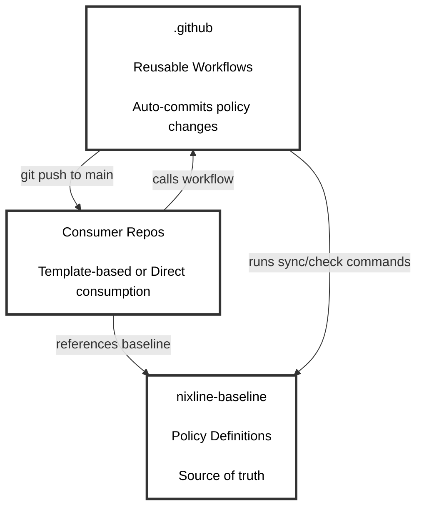

The **`.github`** repository (this repo) contains reusable workflows that auto-commit policy updates. The **`nixline-baseline`** repository stores policy packs and Nix apps. **Consumer repos** are your actual projects with automated sync enabled.

**Three consumption patterns:**
- **Direct (Default):** `nix run github:org/baseline#sync` - no configuration files needed
- **Configuration-driven (Recommended):** `nix run github:org/baseline#sync -- --config .nixline.toml` - organization branding via TOML
- **Template-based:** Consumer repos have `flake.nix` with baseline as input for external packs

**Instant materialization:** Policy changes are pushed directly to consumer repos without PR bottlenecks. Organizations requiring review can use branch protection rules.

**Note on forking:** Organizations should fork this repository to customize workflows for their own baseline. The workflows reference specific baseline repositories and need to be updated to point to your organization's forked baseline. This gives you complete control over CI/CD automation while maintaining the same workflow structure.

---

## Security & Permissions

### Reusable Workflow Security Model

NixLine follows GitHub's security best practices for reusable workflows by **not defining permissions** in the reusable workflows themselves. This gives calling workflows complete control over what permissions to grant.

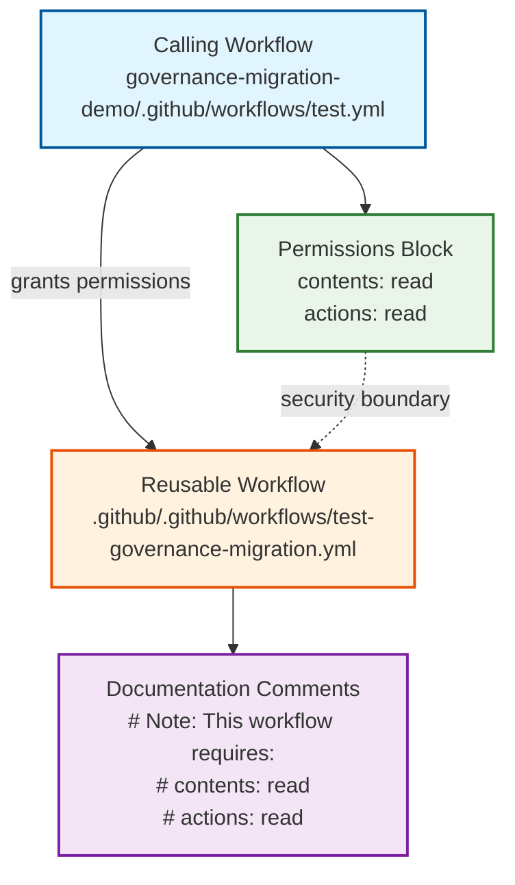

### Security Benefits

| Security Aspect | Benefit |
|-----------------|---------|
| **Principle of Least Privilege** | Each calling workflow grants only the permissions it actually needs |
| **Explicit Permission Control** | Organizations can see exactly what permissions they're granting |
| **No Permission Inheritance** | Reusable workflows cannot escalate permissions beyond what's granted |
| **Audit Trail** | Permission grants are visible in calling workflow files |
| **Customizable Security** | Organizations can modify permissions when forking |

###  Permission Requirements by Workflow

| Reusable Workflow | Required Permissions | Purpose |
|-------------------|---------------------|---------|
| `nixline-ci.yml` | `contents: read` | Checkout repository for CI checks |
| `nixline-policy-sync-smart.yml` | `contents: write`<br/>`pull-requests: write`<br/>`issues: write` | Commit or create PRs<br/>Manage PRs<br/>Create issues for conflicts |
| `nixline-policy-sync.yml` | `contents: write`<br/>`issues: write` | **[DEPRECATED]** Commit policy updates<br/>Create issues for conflicts |
| `migrate-governance.yml` | `contents: write`<br/>`pull-requests: write`<br/>`actions: read` | Commit generated baseline<br/>Create PR (when using PR mode)<br/>Read workflow artifacts |
| `test-governance-migration.yml` | `contents: read`<br/>`actions: read` | Clone external repositories<br/>Upload migration reports |

### How to Use Reusable Workflows Securely

**Correct Usage:**
```yaml
name: CI
on: [push, pull_request]

permissions:
  contents: read  # Explicitly grant required permissions

jobs:
  test:
    uses: NixLine-org/.github/.github/workflows/nixline-ci.yml@stable
```

**Insecure Usage:**
```yaml
name: CI
on: [push, pull_request]

permissions: write-all  # Over-privileged!

jobs:
  test:
    uses: NixLine-org/.github/.github/workflows/nixline-ci.yml@stable
```

### Security Considerations

- **Always use specific permissions**: Avoid `permissions: write-all` or overly broad permissions
- **Pin to stable tags**: Use `@stable` or specific commit SHAs instead of `@main`
- **Review permission requirements**: Check the workflow documentation for required permissions
- **Monitor permission changes**: When updating to new workflow versions, review any permission requirement changes

---

## Available Workflows

This repository provides several reusable workflows for NixLine automation. Each workflow serves a specific purpose in the governance and automation pipeline.

### Overview

| Workflow | Purpose | Used By | Pattern |
|----------|---------|---------|---------|
| `nixline-ci.yml` | Basic CI validation | All consumer repos | All patterns |
| `nixline-feature-branch-validation.yml` | **Comprehensive feature branch validation with security checks** | Baseline repos | Secure feature branch validation |
| `nixline-branch-validation.yml` | **Complete automation: unstable → main → stable** | Baseline repos | Complete automation workflow |
| `nixline-policy-sync-smart.yml` | **Smart policy sync (RECOMMENDED)** | Consumer repos | Adaptive |
| `nixline-promote-to-stable.yml` | Promote commits to stable with validation | Baseline repos | Release management |
| `nixline-policy-sync.yml` | ~~Direct policy sync~~ **DEPRECATED** | Legacy only | Direct commit |
| `nixline-policy-sync-pr.yml` | ~~Policy sync with PRs~~ **DEPRECATED** | Legacy only | Auto-approved PRs |
| `nixline-auto-approve.yml` | Auto-approve PRs | Consumer repos | Auto-approved PRs |
| `nixline-dependabot-automerge.yml` | Dependabot auto-merge | Consumer repos | Dependency automation |
| `nixline-flake-update.yml` | Flake lock updates | Template-based repos | Template pattern |
| `nixline-policy-flake-lock-only.yml` | Policy lock updates | Template-based repos | Template pattern |
| `nixline-pre-commit.yml` | Pre-commit hooks | Consumer repos | Code formatting |
| `update-stable-tag.yml` | Auto-update stable tags | Baseline repos | Tag automation |
| `validate-workflows.yml` | Validate YAML and GitHub Actions syntax | Any repo | Workflow quality control |
| `nixline-flake-lock-update.yml` | Update flake.lock files | Any repo with flakes | Dependency management |
| `migrate-governance.yml` | Migrate governance repositories | Organizations | Governance migration |
| `test-governance-migration.yml` | Test migration compatibility | Governance repos | Migration testing |
| `nixline-nixpkgs-update.yml` | Fetch latest nixpkgs commit | Baseline repos | Supply chain security |
| `nixline-nixpkgs-validate.yml` | Validate nixpkgs updates | Baseline repos | Supply chain security |
| `nixline-nixpkgs-promote.yml` | Promote validated updates | Baseline repos | Supply chain security |

### CI Workflow

**Flow Diagram:**
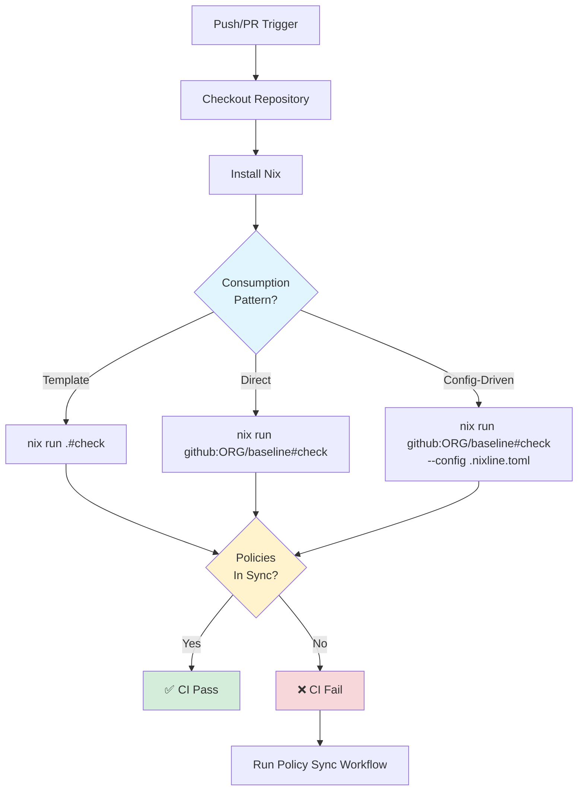

### Branch Validation Workflow

The **branch validation workflow** provides a comprehensive development workflow for baseline repositories. It enables teams to work on feature branches while maintaining main branch protection through automated validation and promotion.

**Key Features:**
- Always updates unstable tag for immediate testing availability
- Runs comprehensive validation (flake check, app verification, content validation)
- Creates PRs with promote-to-stable label when validation passes
- Auto-approves and auto-merges validated PRs to main branch
- Integrates with baseline CI for automatic stable tag promotion
- Creates issues when validation fails (assigned to branch author)
- Manages issue lifecycle (auto-closes when tests pass)

**Flow Diagram:**
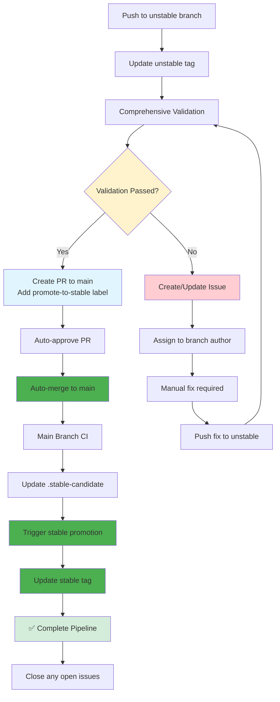

**Usage in Baseline Repository:**
```yaml
# .github/workflows/branch-validation.yml
name: Branch Validation
on:
  push:
    branches-ignore: [main]

permissions:
  contents: write
  pull-requests: write
  issues: write

jobs:
  validate:
    uses: YOUR-ORG/.github/.github/workflows/nixline-branch-validation.yml@stable
    with:
      baseline_repo: YOUR-ORG/nixline-baseline
      validation_apps: "sync,check,import-policy,fetch-license,list-licenses"
      issue_labels: "validation-failure,automated"
```

**Development Workflow:**
1. **Work on unstable branch**: `git checkout unstable` (primary development branch)
2. **Make Changes**: Modify packs, apps, or configuration
3. **Push to unstable**: `git push origin unstable`
4. **Complete Automation**:
   - Unstable tag updates immediately (available for testing)
   - Validation runs (flake check, app tests, content validation)
   - If tests pass: PR created with promote-to-stable label and auto-merged to main
   - Main branch CI updates .stable-candidate and triggers stable promotion
   - If tests fail: Issue created and assigned to you
5. **Fix Issues**: Address any validation failures and push fixes to unstable
6. **Automatic Completion**: Complete pipeline from unstable → main → stable with no manual steps

**Benefits:**
- **Complete Automation**: Zero manual steps from development to production
- **Protected Main Branch**: All changes validated before merge
- **Immediate Testing**: Unstable tag allows testing changes instantly
- **Developer-Friendly**: Automatic promotion through entire pipeline when tests pass
- **Fast Feedback**: Issues created with detailed error information for failures
- **Full Audit Trail**: PR history with promote-to-stable labels maintained for all changes
- **Stable Tag Automation**: Automatic stable tag updates when main branch CI passes

---

## Workflow Documentation

### Basic CI ([`nixline-ci.yml`](.github/workflows/nixline-ci.yml))

**CONSUMER REPOSITORIES ONLY** - Provides fundamental CI validation for NixLine consumer repositories including policy compliance checks and basic testing.

**IMPORTANT:** This workflow is designed specifically for consumer repositories that materialize and validate policy files FROM a baseline repository. Do NOT use for baseline repositories.

**Repository Types:**
- [+] Consumer repositories - materializes files from baseline and validates compliance
- [-] Baseline repositories - use local CI that validates source integrity (flake check, apps)

**Features:**
- Policy compliance validation by materializing files from baseline
- Nix flake evaluation
- Basic health checks for materialized policies
- Supports all consumption patterns (direct, configuration-driven, template-based)

**Usage:**
```yaml
jobs:
  nixline-ci:
    uses: YOUR-ORG/.github/.github/workflows/nixline-ci.yml@stable
    with:
      channel: stable
      consumption_pattern: direct  # or configuration-driven, template-based
```

### Feature Branch Validation ([`nixline-feature-branch-validation.yml`](.github/workflows/nixline-feature-branch-validation.yml))

**BASELINE REPOSITORIES** - Comprehensive security and quality validation for pull requests targeting protected branches (e.g., unstable). Enforces strict standards before allowing feature branch merges.

**Security Features:**
- **CodeQL Analysis:** Semantic code analysis for security vulnerabilities
- **Dependency Scanning:** Trivy vulnerability scanner for dependencies
- **Secret Detection:** Pattern matching for common secret types
- **Commit Message Validation:** Enforces conventional commit standards

**Quality Checks:**
- **Nix Validation:** Full flake check across all systems + app verification
- **YAML/Workflow Validation:** Syntax validation for all configuration files
- **Content Validation:** Prevents problematic placeholder content
- **CODEOWNERS Validation:** Syntax validation and team reference checks
- **Shell Script Validation:** Basic shellcheck integration

**Required Workflow:**
```
Feature Branch → PR to unstable → All validations pass + 1 review → Merge to unstable
```

**Usage:**
```yaml
# .github/workflows/feature-branch-validation.yml
name: Feature Branch Validation
on:
  pull_request:
    branches: [unstable]
    types: [opened, synchronize, reopened]

permissions:
  contents: read
  security-events: write
  pull-requests: read

jobs:
  validate:
    uses: NixLine-org/.github/.github/workflows/nixline-feature-branch-validation.yml@stable
    with:
      target_branch: unstable
      validation_apps: "sync,check,import-policy,fetch-license,list-licenses"
      require_conventional_commits: true
      enable_codeql: true
```

**Branch Protection Requirements:**
- Require PR reviews (1+ maintainer approval)
- Require all status checks to pass
- Restrict direct pushes to `unstable` branch
- Require branches to be up to date

### Branch Validation (`nixline-branch-validation.yml`)

Provides comprehensive branch-based development workflow for baseline repositories with automated validation, PR creation, and issue management.

**Features:**
- Immediate unstable tag updates for testing
- Comprehensive validation (flake check, app verification, content validation)
- Automatic PR creation and merging when validation passes
- Issue creation and management when validation fails
- Branch author assignment for clear responsibility
- Issue auto-closure when validation passes

**Usage:**
```yaml
# .github/workflows/branch-validation.yml
name: Branch Validation
on:
  push:
    branches-ignore: [main]

permissions:
  contents: write
  pull-requests: write
  issues: write

jobs:
  validate:
    uses: YOUR-ORG/.github/.github/workflows/nixline-branch-validation.yml@stable
    with:
      baseline_repo: YOUR-ORG/nixline-baseline
      validation_apps: "sync,check,import-policy,fetch-license,list-licenses"
      issue_labels: "validation-failure,automated"
```

**Configuration Options:**
| Parameter | Type | Default | Description |
|-----------|------|---------|-------------|
| `baseline_repo` | string | Required | Repository name (e.g., "org/nixline-baseline") |
| `validation_apps` | string | `sync,check,import-policy,fetch-license,list-licenses` | Apps to validate (comma-separated) |
| `issue_labels` | string | `validation-failure,automated` | Labels for validation failure issues |

**When to Use:**
- Baseline repositories with active development
- Teams requiring protected main branches
- Projects needing comprehensive validation before merge
- Organizations wanting automated issue tracking for failures

## Workflow Diagrams

Visual representation of how each workflow operates:

### Policy Sync Smart (`nixline-policy-sync-smart.yml`)

The **recommended** unified policy sync workflow that intelligently handles all synchronization scenarios with automatic fallback patterns and rate limit protection for organizations managing hundreds of repositories.

**Key Features:**
- Attempts direct push first for speed
- Falls back to PR when branch protection requires it
- Handles merge conflicts gracefully
- Validates content for placeholder text
- Protects against API rate limits
- Single workflow replaces both deprecated patterns

**Flow Diagram:**
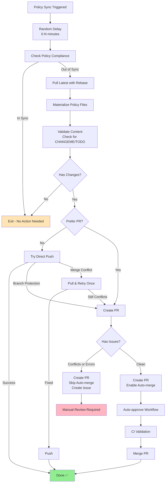

**Usage:**
```yaml
name: Policy Sync

on:
  schedule:
    - cron: '0 14 * * 0'  # Weekly
  workflow_dispatch:

permissions:
  contents: write
  pull-requests: write
  issues: write

jobs:
  sync:
    uses: YOUR-ORG/.github/.github/workflows/nixline-policy-sync-smart.yml@stable
    with:
      consumption_pattern: direct
      baseline_repo: YOUR-ORG/nixline-baseline
      baseline_ref: main
      prefer_pr: false         # Try direct push first (default)
      auto_merge: true         # Enable auto-merge if PR created
      stagger_minutes: 5       # Random delay to prevent rate limits
```

**Configuration Options:**
| Parameter | Type | Default | Description |
|-----------|------|---------|-------------|
| `baseline_ref` | string | `main` | Baseline branch/tag to sync from |
| `consumption_pattern` | string | `direct` | Pattern: direct, template-based, or configuration-driven |
| `baseline_repo` | string | `NixLine-org/nixline-baseline` | Baseline repository |
| `config_file` | string | `.nixline.toml` | Config file for configuration-driven pattern |
| `prefer_pr` | boolean | `false` | Always create PR even if direct push would work |
| `auto_merge` | boolean | `true` | Enable auto-merge on PRs |
| `stagger_minutes` | number | `5` | Max random delay in minutes for rate limiting |

**Rate Limit Protection:**

The workflow includes automatic protection against GitHub API rate limits (80 PRs/minute, 500 PRs/hour) through:
- **Staggered execution**: Random delays distribute load across time
- **Natural throttling**: Workflow runtime prevents burst creation
- **Graceful failures**: Creates issues instead of failing silently

**Advantages over deprecated workflows:**
- **One workflow for all scenarios** - simpler configuration
- **Intelligent fallback** - optimal path for each situation
- **Built-in safety** - validation and conflict handling
- **Scale-ready** - handles 500+ repositories without hitting rate limits
- **Better error reporting** - detailed GitHub Step Summary output

### Policy Sync Workflow Comparison

**Direct Commit Pattern (`nixline-policy-sync.yml`):**
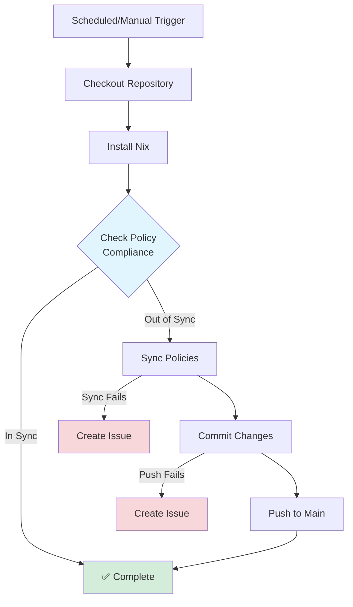

**Pull Request Pattern (`nixline-policy-sync-pr.yml`):**
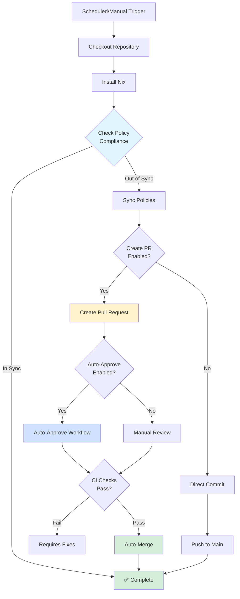

**Key Differences:**

| Feature | Direct Commit | Pull Request |
|---------|---------------|--------------|
| **Audit Trail** | Git commits only | Full PR history with reviews |
| **Branch Protection** | Not compatible | Works seamlessly |
| **Speed** | Instant | Requires CI completion |
| **Auto-Approval** | N/A | Optional via workflow |
| **Enterprise Ready** | Basic | Full compliance features |
| **Best For** | Simple repos, fast updates | Enterprise, audit requirements |

### Policy Sync (`nixline-policy-sync.yml`) **[DEPRECATED]**

⚠️ **This workflow is deprecated. Use [`nixline-policy-sync-smart.yml`](#policy-sync-smart-nixline-policy-sync-smartyml) instead.**

Automatically syncs policy files from the baseline repository with instant materialization via direct commits.

**Included in:** Consumer template (`nixline-baseline/templates/consumer/.github/workflows/policy-sync.yml`)

**Usage:**

**Template-based repositories:**
```yaml
# .github/workflows/policy-sync.yml
name: Policy Sync
on:
  schedule:
    - cron: '0 14 * * 0'  # Weekly on Sunday at 2 PM UTC
  workflow_dispatch:
jobs:
  sync:
    uses: YOUR-ORG/.github/.github/workflows/nixline-policy-sync.yml@stable
    with:
      consumption_pattern: template-based
      baseline_ref: stable
```

**Direct consumption and configuration-driven repositories:**
```yaml
# .github/workflows/policy-sync.yml (or add to existing ci.yml)
name: Policy Sync
on:
  schedule:
    - cron: '0 14 * * 0'  # Weekly on Sunday at 2 PM UTC
  workflow_dispatch:
jobs:
  sync:
    uses: YOUR-ORG/.github/.github/workflows/nixline-policy-sync.yml@stable
    with:
      consumption_pattern: direct
      baseline_repo: YOUR-ORG/nixline-baseline
      baseline_ref: stable
      # Optional: specify configuration file for organization branding
      config_file: .nixline.toml
```

**What it does:**

The workflow runs sync/check commands to validate policies. If out of sync, it materializes updated policy files, then auto-commits and pushes changes directly to the main branch.

**Command patterns used:**
- **Template-based repos:** `nix run .#check` and `nix run .#sync`
- **Direct consumption repos:** `nix run github:ORG/nixline-baseline#check` and `nix run github:ORG/nixline-baseline#sync`
- **Configuration-driven repos:** `nix run github:ORG/nixline-baseline#sync -- --config .nixline.toml`

**Key advantage:** Traditional governance systems create pull requests for every baseline update, requiring manual review across potentially hundreds of repositories. This workflow eliminates that bottleneck by materializing changes instantly through Nix flakes and committing them automatically. Policy updates propagate immediately without manual intervention.

**Enhanced baseline features:**
- **Runtime configuration passing**: Organizations can customize policies via `.nixline.toml` without forking
- **CLI overrides**: `--override org.name=MyCompany` for runtime customization
- **Custom file support**: Complete file override capability with `custom_file` parameters
- **Parameterized packs**: All policy packs accept configuration for organization branding
- **SPDX license fetching**: Automatic license retrieval with proper attribution

**Branch protection:** Organizations requiring review before policy changes can configure branch protection rules to enforce PR workflows.

**Customization:**
```yaml
# Change the schedule in your consumer repo
schedule:
  - cron: '0 14 * * 0'  # Sunday 2 PM UTC (default)
  #- cron: '0 9 * * 1'   # Monday 9 AM UTC
```

### Policy Sync with Auto-Approved PRs (`nixline-policy-sync-pr.yml`) **[DEPRECATED]**

⚠️ **This workflow is deprecated. Use [`nixline-policy-sync-smart.yml`](#policy-sync-smart-nixline-policy-sync-smartyml) with `prefer_pr: true` instead.**

Creates pull requests for policy updates with optional auto-approval for enterprise governance requirements.

**Enterprise-Ready Features:**
- Creates PRs instead of direct commits for audit trails
- Auto-approval integration for policy-only changes
- Works with GitHub's auto-merge functionality
- Detailed PR descriptions with change summaries
- Support for branch protection rules

**Usage for Auto-Approved PR Pattern:**
```yaml
# .github/workflows/policy-sync.yml
name: Policy Sync
on:
  schedule:
    - cron: '0 14 * * 0'  # Weekly on Sunday at 2 PM UTC
  workflow_dispatch:

permissions:
  contents: write
  issues: write
  pull-requests: write

jobs:
  sync:
    uses: YOUR-ORG/.github/.github/workflows/nixline-policy-sync-pr.yml@stable
    with:
      consumption_pattern: direct
      baseline_repo: YOUR-ORG/nixline-baseline
      baseline_ref: stable
      create_pr: true
      auto_approve: true
```

**Required Auto-Approval Workflow:**
```yaml
# .github/workflows/auto-approve.yml
name: Auto Approve Policy Updates
on:
  pull_request:
    types: [opened, synchronize]

jobs:
  auto-approve:
    uses: YOUR-ORG/.github/.github/workflows/nixline-auto-approve.yml@stable
    with:
      pr_title_pattern: "Policy Sync"
      actor_filter: "github-actions[bot]"
      merge_method: "squash"
      enable_auto_merge: true
      require_checks: true
```

**Enterprise Setup Requirements:**
1. Enable branch protection requiring PR reviews in repository settings
2. Configure auto-merge in repository settings
3. Add the auto-approval workflow to consumer repositories
4. Ensure CI checks validate policy changes before merge

**Demonstrated in:** [nixline-demo3](https://github.com/NixLine-org/nixline-demo3) showcases this pattern with pure upstream consumption and zero maintenance overhead.

### Auto-Approve Workflow

**Flow Diagram:**
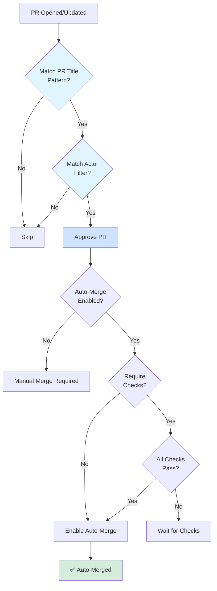

### Auto-Approve (`nixline-auto-approve.yml`)

Reusable workflow for automatically approving and merging PRs that meet specified criteria.

**Features:**
- Configurable PR title patterns for approval
- Actor filtering for security
- Multiple merge methods (merge, squash, rebase)
- Optional auto-merge enablement
- Detailed approval comments with audit trail

**Usage:**
```yaml
# .github/workflows/auto-approve.yml
name: Auto Approve
on:
  pull_request:
    types: [opened, synchronize]

jobs:
  auto-approve:
    uses: YOUR-ORG/.github/.github/workflows/nixline-auto-approve.yml@stable
    with:
      pr_title_pattern: "Policy Sync"  # Pattern to match in PR title
      actor_filter: "github-actions[bot]"  # Must be created by this actor
      merge_method: "squash"  # merge, squash, or rebase
      enable_auto_merge: true  # Enable GitHub auto-merge
      require_checks: true  # Require status checks to pass
```

**Common Use Cases:**
- Policy sync PRs from automated workflows
- Dependabot PRs for patch/minor updates
- Documentation updates from bots
- License file updates from SPDX fetching

**Security Considerations:**
- Always use actor filtering to prevent unauthorized approvals
- Configure branch protection rules as additional safeguards
- Require status checks to pass before auto-merge
- Use specific PR title patterns to limit scope

### Dependabot Auto-Merge Workflow

**Flow Diagram:**
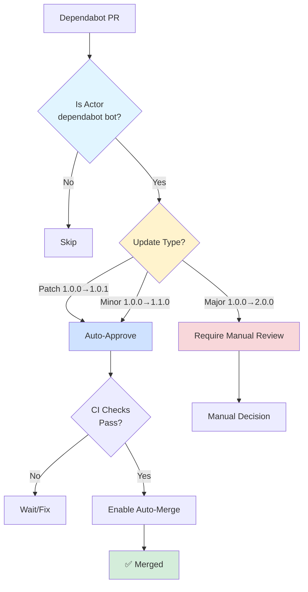

### Dependabot Auto-Merge (`nixline-dependabot-automerge.yml`)

Automatically approves and merges Dependabot PRs for patch and minor updates when CI passes.

**Features:**
- Auto-approves patch and minor version updates
- Requires CI checks to pass before merge
- Maintains audit trail through PR comments
- Configurable version update policies

**Usage:**
```yaml
# .github/workflows/dependabot-automerge.yml
name: Dependabot Auto-Merge
on:
  pull_request:
    types: [opened, synchronize]

jobs:
  automerge:
    if: github.actor == 'dependabot[bot]'
    uses: YOUR-ORG/.github/.github/workflows/nixline-dependabot-automerge.yml@stable
```

**Merge Policy:**
- Patch updates (1.0.0 → 1.0.1): Auto-merge
- Minor updates (1.0.0 → 1.1.0): Auto-merge
- Major updates (1.0.0 → 2.0.0): Require manual review

### Flake Updates (`nixline-flake-update.yml`)

Updates flake.lock files for template-based repositories to keep dependencies current.

**Features:**
- Automated flake.lock updates
- Creates PRs with dependency changes
- Includes detailed change summaries
- Template-based consumption pattern only

**Usage:**
```yaml
# .github/workflows/flake-update.yml
name: Flake Update
on:
  schedule:
    - cron: '0 0 * * 1'  # Weekly on Monday
  workflow_dispatch:

jobs:
  update:
    uses: YOUR-ORG/.github/.github/workflows/nixline-flake-update.yml@stable
```

### Policy Lock Updates (`nixline-policy-flake-lock-only.yml`)

Updates only the baseline policy flake lock for template-based repositories.

**Features:**
- Updates baseline flake input only
- Preserves other dependency versions
- Focused policy-only updates
- Template-based consumption pattern only

**Usage:**
```yaml
# .github/workflows/policy-lock-update.yml
name: Policy Lock Update
on:
  schedule:
    - cron: '0 12 * * 0'  # Weekly on Sunday
  workflow_dispatch:

jobs:
  update:
    uses: YOUR-ORG/.github/.github/workflows/nixline-policy-flake-lock-only.yml@stable
```

### Pre-commit Hooks Workflow

**Flow Diagram:**
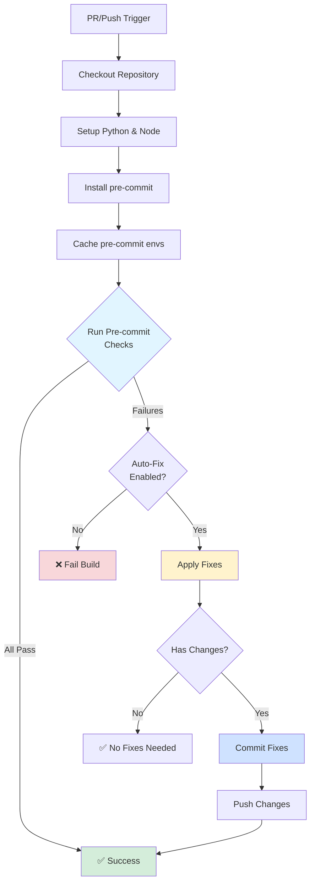

### Pre-commit Hooks (`nixline-pre-commit.yml`)

Runs pre-commit hooks with optional auto-fixing for code formatting and linting.

**Features:**
- Runs all pre-commit hooks defined in `.pre-commit-config.yaml`
- Optional auto-fixing with commit back to repository
- Configurable Python and Node versions
- Caching for faster execution
- Support for running on all files or just changed files

**Usage:**
```yaml
# .github/workflows/pre-commit.yml
name: Pre-commit
on:
  pull_request:
  push:
    branches: [main]

permissions:
  contents: write

jobs:
  pre-commit:
    uses: YOUR-ORG/.github/.github/workflows/nixline-pre-commit.yml@stable
    with:
      auto_fix: true  # Auto-commit fixes
      run_on_all_files: false  # Only check changed files
      python_version: '3.11'
      node_version: '18'
      commit_message: 'apply pre-commit fixes'
```

**Hooks Supported:**
- Python: black, flake8, isort, mypy, pylint
- JavaScript/TypeScript: prettier, eslint
- General: trailing-whitespace, end-of-file-fixer, check-yaml, check-json, check-toml
- Any other pre-commit compatible hook

**Auto-Fix Behavior:**
When `auto_fix: true`, the workflow will:
1. Run pre-commit checks
2. If failures occur, attempt to apply fixes
3. Commit and push the fixes automatically
4. Use github-actions[bot] as the commit author

**Best Practices:**
- Use on pull requests for immediate feedback
- Enable auto-fix for formatting issues
- Run on all files initially, then only on changed files
- Cache dependencies for faster runs

### Stable Tag Update Workflow

**Flow Diagram:**
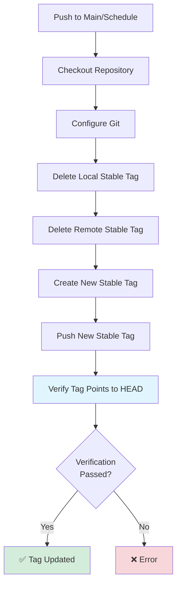

**Important:** This workflow runs automatically on every push to main, ensuring consumer repos always reference the latest stable code.

### Stable Tag Updates (`update-stable-tag.yml`)

Automatically keeps stable tags synchronized with the latest main branch commits.

**Features:**
- Automated stable tag updates on push to main
- Daily cron schedule as backup
- Manual trigger support
- Configurable tag names and target branches
- Detailed verification and logging

**Usage:**
```yaml
# .github/workflows/update-stable-tag.yml
name: Always Keep Stable Tag Updated
on:
  push:
    branches: [main]
  schedule:
    - cron: '0 6 * * *'  # Daily at 6 AM UTC
  workflow_dispatch:

permissions:
  contents: write

jobs:
  update-stable-tag:
    uses: YOUR-ORG/.github/.github/workflows/update-stable-tag.yml@stable
    with:
      tag_name: stable
      target_branch: main
```

**IMPORTANT SECURITY CONSIDERATION:**

When using this workflow, always enable branch protection on your main branch. The stable tag automatically updates to point to the latest main commit, so any direct push to main would immediately be tagged as "stable" and potentially deployed to production or consumed by other repositories.

Configure branch protection to require pull request reviews before merging, dismiss stale reviews when new commits are pushed, require status checks to pass, and include administrators in restrictions. This ensures all changes go through proper review before being automatically tagged as stable.

---

### Workflow Validation (`validate-workflows.yml`)

Validates all workflow files for YAML syntax, GitHub Actions syntax, and shell scripts. This workflow runs automatically in the .github repository and can be used as a reusable workflow by other repositories.

**Features:**
- YAML syntax validation with yamllint
- GitHub Actions syntax validation with actionlint
- Shell script validation within workflows
- Permissions documentation checks for reusable workflows
- Baseline workflow pattern validation

**Usage as Reusable Workflow:**
```yaml
# .github/workflows/validate-workflows.yml
name: Validate Workflows
on:
  push:
    paths:
      - '.github/workflows/*.yml'
  pull_request:
    paths:
      - '.github/workflows/*.yml'

permissions:
  contents: read

jobs:
  validate:
    uses: YOUR-ORG/.github/.github/workflows/validate-workflows.yml@stable
```

**Automatic Usage:**
The workflow automatically runs in the .github repository on every push and pull request to validate all reusable workflows before they're deployed organization-wide.

**Benefits:**
- Prevents broken workflows from being deployed
- Ensures consistent quality across all organization workflows
- Validates shell scripts and permissions documentation
- Catches syntax errors before they affect consumer repositories

---

### Flake Lock Updates (`nixline-flake-lock-update.yml`)

Automatically updates flake.lock files when flake.nix changes or on demand.

**Features:**
- Triggered automatically when flake.nix changes
- Manual trigger support via workflow_dispatch
- Validates updated flake before committing
- Configurable flake directory location
- Detailed change reporting in workflow summary

**Usage:**

```yaml
# .github/workflows/update-consumer-template-flake-lock.yml
name: Update Consumer Template Flake Lock

on:
  push:
    branches:
      - main
    paths:
      - 'templates/consumer/flake.nix'
  workflow_dispatch:

permissions:
  contents: write

jobs:
  update-flake-lock:
    uses: YOUR-ORG/.github/.github/workflows/nixline-flake-lock-update.yml@stable
    with:
      flake-directory: 'templates/consumer'
      commit-message: 'Update consumer template flake.lock'
      validate-after-update: true
```

**How It Works:**
1. Detects changes to flake.nix via paths filter
2. Runs `nix flake update` in specified directory
3. Validates updated flake with `nix flake check`
4. Commits and pushes updated flake.lock
5. Only commits if changes are detected

**Inputs:**
- `flake-directory`: Directory containing flake.nix (default: '.')
- `commit-message`: Custom commit message (default: 'Update flake.lock')
- `validate-after-update`: Run validation after update (default: true)
- `create-pr`: Create a PR instead of pushing directly (default: false)
- `enable-auto-merge`: Enable auto-merge on created PR (default: false)

**Direct Push Mode:**
```yaml
jobs:
  update-flake-lock:
    uses: YOUR-ORG/.github/.github/workflows/nixline-flake-lock-update.yml@stable
    with:
      flake-directory: 'templates/consumer'
      commit-message: 'Update consumer template flake.lock'
      validate-after-update: true
```

**PR Mode with Auto-Merge (for repos with branch protection):**
```yaml
permissions:
  contents: write
  pull-requests: write

jobs:
  update-flake-lock:
    uses: YOUR-ORG/.github/.github/workflows/nixline-flake-lock-update.yml@stable
    with:
      flake-directory: 'templates/consumer'
      commit-message: 'Update consumer template flake.lock'
      validate-after-update: true
      create-pr: true
      enable-auto-merge: true
```

**Use Cases:**
- Baseline repos with consumer templates
- Any repository with flake.nix that needs automatic dependency updates
- Multi-flake repositories with templates in subdirectories
- Repositories with branch protection requiring PRs

---

### Governance Migration (`migrate-governance.yml`)

This reusable workflow automates the migration of existing governance repositories to NixLine baseline format using deterministic repository fetching.

**Use Case:** Organizations wanting to convert their existing governance files (LICENSE, SECURITY.md, CODEOWNERS, etc.) into a complete NixLine baseline.

**Example Usage:**
```yaml
# .github/workflows/create-nixline-baseline.yml
name: Create NixLine Baseline from Governance

on:
  workflow_dispatch:
    inputs:
      organization-name:
        description: 'Organization name'
        required: true
        type: string
      organization-email:
        description: 'Organization contact email'
        required: true
        type: string

jobs:
  migrate:
    uses: NixLine-org/.github/.github/workflows/migrate-governance.yml@stable
    with:
      governance-repo: ${{ github.server_url }}/${{ github.repository }}
      organization-name: ${{ inputs.organization-name }}
      organization-email: ${{ inputs.organization-email }}
      output-mode: 'artifact'
```

**Key Features:**
- Uses `builtins.fetchGit` for deterministic repository fetching
- Automatically detects project languages and existing governance files
- Generates complete NixLine baseline with organization-specific configuration
- Supports GitHub URLs, local paths, and private repositories
- Creates downloadable artifacts or commits directly to repository
- Provides comprehensive migration reports with next-step instructions

**Output Modes:**
- `artifact`: Creates downloadable ZIP with generated baseline
- `commit`: Commits generated baseline directly to target branch
- `pr`: Creates pull request with generated baseline (manual PR creation required)

### Test Governance Migration (`test-governance-migration.yml`)

This reusable workflow tests whether a governance repository is compatible with NixLine migration before performing actual migration.

**Use Case:** Governance repositories wanting to validate their migration readiness and compatibility with NixLine.

**Example Usage:**
```yaml
# .github/workflows/test-nixline-migration.yml
name: Test NixLine Migration Compatibility

on:
  push:
    branches: [ main ]
  pull_request:
    branches: [ main ]
  workflow_dispatch:

jobs:
  test-migration:
    uses: NixLine-org/.github/.github/workflows/test-governance-migration.yml@stable
    with:
      organization-name: "Test Organization"
      organization-email: "admin@example.com"
      dry-run-only: true
```

**What It Tests:**
- Repository structure analysis (languages, governance files, configuration files)
- Migration compatibility with current NixLine baseline
- Generated baseline validation (when dry-run-only is false)
- Edge case handling (empty repositories, missing files, permission issues)

**Output:**
- Comprehensive migration readiness assessment
- Detailed analysis of detected capabilities
- Step-by-step instructions for full migration
- Testing recommendations for different scenarios

**Advanced Testing:**
```yaml
# Test full migration with artifact generation
jobs:
  full-test:
    uses: NixLine-org/.github/.github/workflows/test-governance-migration.yml@stable
    with:
      organization-name: "Full Test Organization"
      organization-email: "test@example.com"
      security-email: "security@example.com"
      dry-run-only: false  # Generates actual baseline
      baseline-ref: "github:yourorg/custom-nixline-baseline"
```

### Supply Chain Security Workflows

NixLine provides three reusable workflows that work together to automate nixpkgs dependency updates with validation and testing before promotion to stable. This implements the supply chain security best practices documented in SECURITY-BASELINE.md by pinning nixpkgs to specific commit hashes instead of branch references.

**Architecture Overview:**

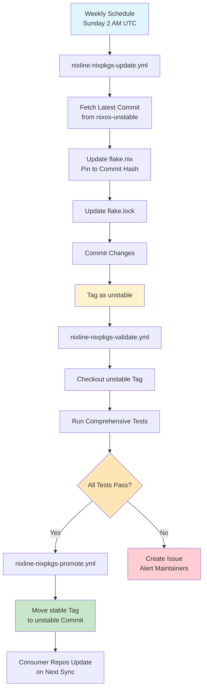

#### Nixpkgs Update (`nixline-nixpkgs-update.yml`)

Fetches the latest nixos-unstable commit hash and updates the baseline repository's flake.nix to pin to that specific commit. This replaces branch references with explicit commit hashes for better supply chain security.

**Example Usage in Baseline Repository:**
```yaml
# .github/workflows/update-nixpkgs.yml
name: Update Nixpkgs

on:
  schedule:
    - cron: '0 2 * * 0'  # Weekly on Sunday at 2 AM UTC
  workflow_dispatch:

permissions:
  contents: write

jobs:
  update:
    uses: NixLine-org/.github/.github/workflows/nixline-nixpkgs-update.yml@stable
    with:
      unstable_tag: unstable
      target_branch: main
      nixpkgs_channel: nixos-unstable
```

**What It Does:**
- Queries GitHub API for latest nixos-unstable commit
- Updates flake.nix to replace branch reference with commit hash
- Runs `nix flake update` to sync flake.lock
- Commits changes and tags as "unstable"
- Triggers validation workflow automatically

#### Nixpkgs Validate (`nixline-nixpkgs-validate.yml`)

Runs comprehensive validation on the unstable tag before promoting to stable. This ensures that nixpkgs updates do not break baseline functionality.

**Example Usage in Baseline Repository:**
```yaml
# .github/workflows/validate-unstable.yml
name: Validate Unstable Nixpkgs

on:
  push:
    tags:
      - unstable

permissions:
  contents: write
  issues: write

jobs:
  validate:
    uses: NixLine-org/.github/.github/workflows/nixline-nixpkgs-validate.yml@stable
    with:
      tag_to_validate: unstable
      promote_on_success: true
      stable_tag: stable
```

**Validation Steps:**
- Verifies flake.nix uses commit hash (not branch reference)
- Runs `nix flake check` on the baseline
- Builds all exposed apps (sync, check, migrate-governance, etc.)
- Tests sync and check operations in isolation
- On success: calls promote workflow
- On failure: creates issue with error details

#### Nixpkgs Promote (`nixline-nixpkgs-promote.yml`)

Promotes a validated nixpkgs update by moving the stable tag to the unstable commit. This is called automatically by the validate workflow on successful validation.

**What It Does:**
- Checks out the validated commit (unstable tag)
- Moves stable tag to that commit
- Pushes updated stable tag
- Consumer repositories receive the update on their next sync

**Benefits:**

The supply chain update pipeline provides explicit commit pinning in flake.nix for better auditability, automated testing before production deployment, safe rollback via tag management, clear audit trail of dependency updates and weekly update schedule to balance security with stability.

---

## Forking for Your Organization

When you fork NixLine for your organization, start by forking this repository:

```bash
gh repo fork NixLine-org/.github --org YOUR-ORG --fork-name .github
cd .github
```

Most workflows are consumer-side (in the template), but you can add organization-wide workflows here. For example, create a reusable security scan workflow:

```yaml
# .github/workflows/org-wide-security-scan.yml
name: Organization Security Scan

on:
  workflow_call:
    # Define reusable workflow that all repos can call
```

After making changes, tag and publish your workflows:

```bash
git add .
git commit -m "feat: initialize org workflows"
git push origin main

git tag -a stable -m "Initial stable release"
git push origin stable
```

Consumer repos can then reference your workflows:

```yaml
# Consumer repo .github/workflows/ci.yml
jobs:
  security-scan:
    uses: YOUR-ORG/.github/.github/workflows/org-wide-security-scan.yml@stable
```

---

## Workflow Best Practices

### Version Pinning

Always use tags when calling reusable workflows:

```yaml
# Good - pinned to stable tag
uses: YOUR-ORG/.github/.github/workflows/some-workflow.yml@stable

# Bad - uses latest main (unpredictable)
uses: YOUR-ORG/.github/.github/workflows/some-workflow.yml@main
```

### Updating Workflows

When you update workflows in this repo:

1. Test in a consumer repo first
2. Commit and push to `main`
3. Re-tag `stable`:
   ```bash
   git tag -d stable
   git push origin :refs/tags/stable
   git tag -a stable -m "Update workflows"
   git push origin stable
   ```
4. Consumer repos will use the new version on their next run

---

## Consumer Workflow Setup

Consumer repositories are initialized using the baseline's template system. When you run `nix flake init -t github:YOUR-ORG/nixline-baseline` in a new repository, Nix copies files from the baseline's `templates/consumer/` directory, which includes the policy sync workflow preconfigured.

### Policy Sync Workflow

```yaml
# .github/workflows/policy-sync.yml (included in template)
name: Policy Sync

on:
  schedule:
    - cron: '0 14 * * 0'  # Weekly on Sunday at 2 PM UTC
  workflow_dispatch:

jobs:
  sync:
    uses: YOUR-ORG/.github/.github/workflows/nixline-policy-sync.yml@stable
```

This calls the reusable workflow which handles checking, syncing and committing policy changes automatically.

### Optional: CI Policy Check

Add a policy check to your CI workflow to ensure policies stay in sync. Choose the pattern based on your consumption approach:

**Template-based approach:**
```yaml
# .github/workflows/ci.yml
name: CI
on: [push, pull_request]
jobs:
  policy-check:
    runs-on: ubuntu-latest
    steps:
      - uses: actions/checkout@v4
      - uses: cachix/install-nix-action@v31
      - name: Verify policies are in sync
        run: nix run .#check
```

**Direct consumption and configuration-driven approach:**
```yaml
# .github/workflows/ci.yml
name: CI
on: [push, pull_request]
jobs:
  policy-check:
    runs-on: ubuntu-latest
    steps:
      - uses: actions/checkout@v4
      - uses: cachix/install-nix-action@v31
      - name: Verify policies are in sync
        run: nix run github:YOUR-ORG/nixline-baseline#check
        # Note: Configuration files are automatically detected by the check command
```

---

## Relationship to Baseline

The `.github` repository and `nixline-baseline` repository serve different purposes:

| Repository | Purpose | Contains |
|------------|---------|----------|
| `.github` | GitHub Actions automation | Reusable workflows |
| `nixline-baseline` | Policy definitions | Nix packs, apps and templates |

**Consumer repos reference both:**
- **Flake input** → `nixline-baseline` (for policies)
- **Workflow `uses:`** → `.github` (for CI automation)

Example consumer `flake.nix`:
```nix
{
  inputs = {
    nixpkgs.url = "github:NixOS/nixpkgs/nixos-unstable";
    nixline-baseline = {
      url = "github:YOUR-ORG/nixline-baseline?ref=stable";
      inputs.nixpkgs.follows = "nixpkgs";
    };
  };
}
```

Example consumer workflow:
```yaml
# References .github repo for reusable workflows
uses: YOUR-ORG/.github/.github/workflows/some-workflow.yml@stable
```

---

## CODEOWNERS for This Repository

This repository should have its own CODEOWNERS file (NOT managed by NixLine packs):

```
# .github/CODEOWNERS
* @YOUR-ORG/platform-team
/.github/workflows/ @YOUR-ORG/devops
```

Why separate? The `.github` repo defines the automation infrastructure. It needs platform/DevOps ownership, not the same ownership rules as consumer repos.

---

## Maintenance

### Adding New Workflows

1. Create workflow in `.github/workflows/`
2. Test in a consumer repo using `@main`
3. Commit and re-tag `stable`
4. Update consumer repos to use the new workflow

### Deprecating Workflows

1. Add deprecation notice to workflow comments
2. Update documentation
3. Give teams time to migrate (suggest 3-6 months)
4. Remove from `stable` tag

---
