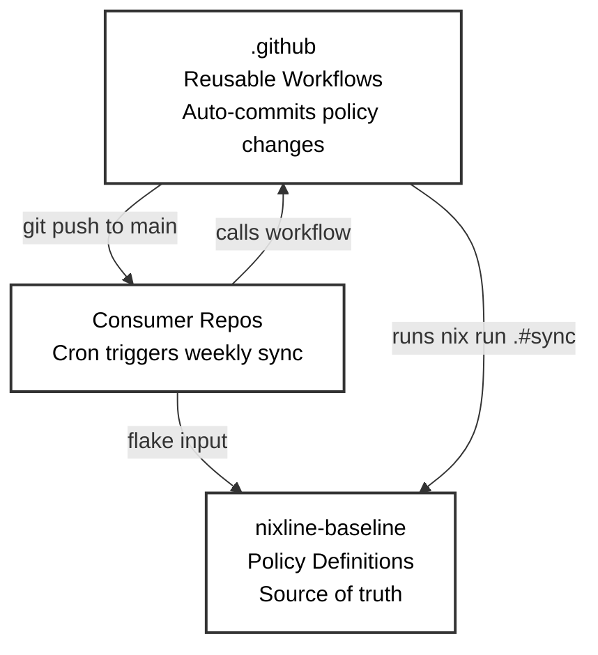

# NixLine Reusable Workflows

This repository contains reusable GitHub Actions workflows for the NixLine organization.

---

## Overview

This is the special `.github` repository that provides **reusable workflows** for all repositories in the NixLine organization. These workflows enforce consistent CI/CD practices, policy compliance and automation across the entire organization.

### What is This Repository?

GitHub allows organizations to create a special repository named `.github` that can:
- Provide **default community health files** (CODE_OF_CONDUCT, CONTRIBUTING, etc.)
- Host **reusable workflows** that any repo in the org can call
- Define **organization-wide templates** and standards

**NixLine uses this repository for:** Reusable CI/CD workflows that integrate with the NixLine baseline.

---

## Architecture

NixLine uses a three-repository architecture with instant policy materialization:



The **`.github`** repository (this repo) contains reusable workflows that auto-commit policy updates. The **`nixline-baseline`** repository stores policy packs and Nix apps. **Consumer repos** are your actual projects with automated sync enabled.

**Instant materialization:** Policy changes are pushed directly to consumer repos without PR bottlenecks. Organizations requiring review can use branch protection rules.

**Note on forking:** Organizations should fork this repository to customize workflows for their own baseline. The workflows reference specific baseline repositories and need to be updated to point to your organization's forked baseline. This gives you complete control over CI/CD automation while maintaining the same workflow structure.

---

## Available Workflows

### Policy Sync (`nixline-policy-sync.yml`)

Automatically syncs policy files from the baseline repository with instant materialization.

**Included in:** Consumer template (`nixline-baseline/templates/consumer/.github/workflows/policy-sync.yml`)

**Usage:**
```yaml
# Consumers get this workflow from the template
# It runs weekly on Sunday at 2 PM UTC by default
jobs:
  sync:
    uses: NixLine-org/.github/.github/workflows/nixline-policy-sync.yml@stable
```

**What it does:**

The workflow runs `nix run .#check` to validate policies. If out of sync, it runs `nix run .#sync` to materialize updated policy files, then auto-commits and pushes changes directly to the main branch.

**Key advantage:** Traditional governance systems create pull requests for every baseline update, requiring manual review across potentially hundreds of repositories. This workflow eliminates that bottleneck by materializing changes instantly through Nix flakes and committing them automatically. Policy updates propagate immediately without manual intervention.

**Branch protection:** Organizations requiring review before policy changes can configure branch protection rules to enforce PR workflows.

**Customization:**
```yaml
# Change the schedule in your consumer repo
schedule:
  - cron: '0 14 * * 0'  # Sunday 2 PM UTC (default)
  #- cron: '0 9 * * 1'   # Monday 9 AM UTC
```

---

## Forking for Your Organization

When you fork NixLine for your organization, start by forking this repository:

```bash
gh repo fork NixLine-org/.github --org YOUR-ORG --fork-name .github
cd .github
```

Most workflows are consumer-side (in the template), but you can add organization-wide workflows here. For example, create a reusable security scan workflow:

```yaml
# .github/workflows/org-wide-security-scan.yml
name: Organization Security Scan

on:
  workflow_call:
    # Define reusable workflow that all repos can call
```

After making changes, tag and publish your workflows:

```bash
git add .
git commit -m "feat: initialize org workflows"
git push origin main

git tag -a stable -m "Initial stable release"
git push origin stable
```

Consumer repos can then reference your workflows:

```yaml
# Consumer repo .github/workflows/ci.yml
jobs:
  security-scan:
    uses: YOUR-ORG/.github/.github/workflows/org-wide-security-scan.yml@stable
```

---

## Workflow Best Practices

### Version Pinning

Always use tags when calling reusable workflows:

```yaml
# Good - pinned to stable tag
uses: YOUR-ORG/.github/.github/workflows/some-workflow.yml@stable

# Bad - uses latest main (unpredictable)
uses: YOUR-ORG/.github/.github/workflows/some-workflow.yml@main
```

### Updating Workflows

When you update workflows in this repo:

1. Test in a consumer repo first
2. Commit and push to `main`
3. Re-tag `stable`:
   ```bash
   git tag -d stable
   git push origin :refs/tags/stable
   git tag -a stable -m "Update workflows"
   git push origin stable
   ```
4. Consumer repos will use the new version on their next run

---

## Consumer Workflow Setup

Consumer repositories are initialized using the baseline's template system. When you run `nix flake init -t github:YOUR-ORG/nixline-baseline` in a new repository, Nix copies files from the baseline's `templates/consumer/` directory, which includes the policy sync workflow preconfigured.

### Policy Sync Workflow

```yaml
# .github/workflows/policy-sync.yml (included in template)
name: Policy Sync

on:
  schedule:
    - cron: '0 14 * * 0'  # Weekly on Sunday at 2 PM UTC
  workflow_dispatch:

jobs:
  sync:
    uses: YOUR-ORG/.github/.github/workflows/nixline-policy-sync.yml@stable
```

This calls the reusable workflow which handles checking, syncing and committing policy changes automatically.

### Optional: CI Policy Check

Add a policy check to your CI workflow to ensure policies stay in sync:

```yaml
# .github/workflows/ci.yml
name: CI

on: [push, pull_request]

jobs:
  policy-check:
    runs-on: ubuntu-latest
    steps:
      - uses: actions/checkout@v4
      - uses: cachix/install-nix-action@v24
      - name: Verify policies are in sync
        run: nix run .#check
```

---

## Relationship to Baseline

The `.github` repository and `nixline-baseline` repository serve different purposes:

| Repository | Purpose | Contains |
|------------|---------|----------|
| `.github` | GitHub Actions automation | Reusable workflows |
| `nixline-baseline` | Policy definitions | Nix packs, apps and templates |

**Consumer repos reference both:**
- **Flake input** → `nixline-baseline` (for policies)
- **Workflow `uses:`** → `.github` (for CI automation)

Example consumer `flake.nix`:
```nix
{
  inputs = {
    nixpkgs.url = "github:NixOS/nixpkgs/nixos-unstable";
    nixline-baseline = {
      url = "github:YOUR-ORG/nixline-baseline?ref=stable";
      inputs.nixpkgs.follows = "nixpkgs";
    };
  };
}
```

Example consumer workflow:
```yaml
# References .github repo for reusable workflows
uses: YOUR-ORG/.github/.github/workflows/some-workflow.yml@stable
```

---

## CODEOWNERS for This Repository

This repository should have its own CODEOWNERS file (NOT managed by NixLine packs):

```
# .github/CODEOWNERS
* @YOUR-ORG/platform-team
/.github/workflows/ @YOUR-ORG/devops
```

Why separate? The `.github` repo defines the automation infrastructure. It needs platform/DevOps ownership, not the same ownership rules as consumer repos.

---

## Maintenance

### Adding New Workflows

1. Create workflow in `.github/workflows/`
2. Test in a consumer repo using `@main`
3. Commit and re-tag `stable`
4. Update consumer repos to use the new workflow

### Deprecating Workflows

1. Add deprecation notice to workflow comments
2. Update documentation
3. Give teams time to migrate (suggest 3-6 months)
4. Remove from `stable` tag

---
